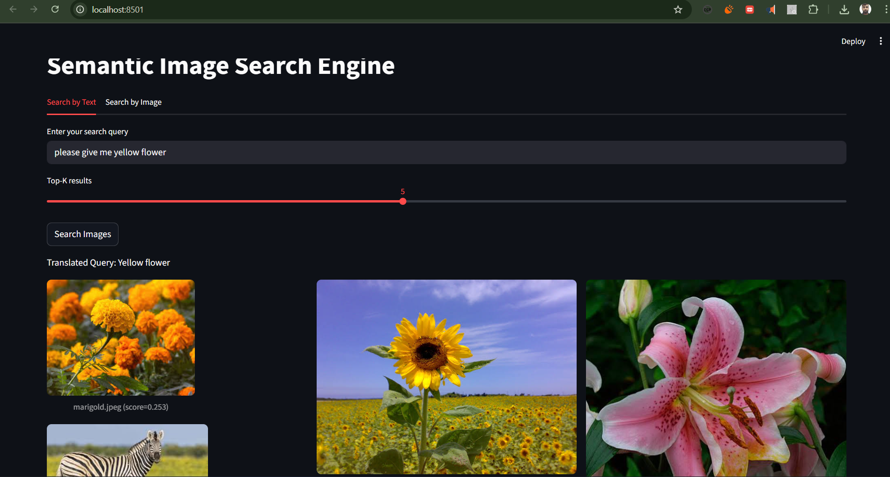
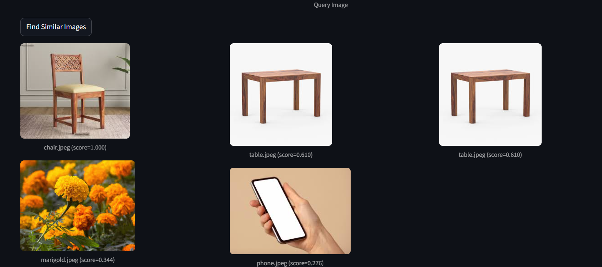

# 🌼 Semantic Image Search Engine

**Multimodal AI Search using CLIP, Qdrant, FastAPI & Streamlit**

This project is a full-stack **semantic image search engine** that understands natural language queries (e.g., *“yellow flower”*) and retrieves the most relevant images using **vector embeddings**.

Built with **OpenCLIP**, **Qdrant**, **FastAPI**, and **Streamlit** — fully container-ready and production-friendly.

---

## 🚀 Features

* 🔍 **Search by Text** → “sunflower”, “car in desert”, “yellow flower”
* 🖼️ **Search by Image** → upload image & find visually similar images
* ⚡ **CLIP Embeddings (ViT-B/32)** for text–image similarity
* 🧠 **Qdrant Vector Database** for fast semantic search
* 🧵 FastAPI backend for embeddings + search pipeline
* 🎨 Streamlit UI for live interactive image search

---

## 📦 Tech Stack

### **Backend**

* FastAPI
* Uvicorn
* Qdrant
* LangChain
* Pydantic
* structlog

### **ML / Embeddings**

* OpenCLIP (ViT-B/32)
* Torch
* HuggingFace

### **Frontend**

* Streamlit

---

## 🔧 Installation

### 1️⃣ Clone the repo

```bash
git clone https://github.com/<your-username>/semantic-image-search-engine.git
cd semantic-image-search-engine
```

### 2️⃣ Create & activate environment

```bash
uv pip install -r requirements.txt
```

(or if using venv + pip:
`python -m venv myenv` → `myenv\Scripts\activate` → `pip install -r requirements.txt`)

### 3️⃣ Verify installed library versions

```bash
python get_lib_versions.py
```

---

## 🖥️ Run the Project

### 1️⃣ Start Backend (FastAPI)

```bash
myenv\Scripts\activate
uvicorn semantic_image_search.backend.main:app --reload
```

Server runs at:

➡ **[http://localhost:8000](http://localhost:8000)**
➡ API Docs: **[http://localhost:8000/docs](http://localhost:8000/docs)**

---

### 2️⃣ Start Frontend (Streamlit UI)

```bash
myenv\Scripts\activate
streamlit run .\semantic_image_search\ui\app.py
```

UI runs at:

➡ **[http://localhost:8501](http://localhost:8501)**

---

## 🏗️ Folder Structure

```
semantic-image-search-engine/
│
├── semantic_image_search/
│   ├── backend/
│   │   ├── main.py
│   │   ├── retriever.py
│   │   ├── qdrant_client.py
│   │   └── config.py
│   │
│   ├── ui/
│   │   └── app.py
│   │
│   ├── embeddings/
│   └── utils/
│
├── images/
├── data/
│   ├── query_images/
│   └── retrieved/
│
├── requirements.txt
├── get_lib_versions.py
└── README.md
```

---

## 📸 Screenshots

Just add this after uploading screenshots:

```


```

---

## 🧠 How It Works

1. User enters text (e.g., “yellow flower”) or uploads an image
2. Text/Image → converted to embeddings using **OpenCLIP**
3. Embedding sent to **Qdrant** for vector similarity search
4. Qdrant returns top-K closest images
5. Streamlit displays results beautifully

---

## 🛠️ To-Do (Future Enhancements)

* 🪄 Add multilingual search
* 🏎️ GPU acceleration for faster embeddings
* 📦 Dockerize backend & frontend
* 📱 Build a simple React frontend

---

## ⭐ Support

If this project helped you, consider giving it a **⭐ star** on GitHub!

Commands:
------------

python C:\Users\simil\OneDrive\Desktop\Multiman\skilldrome\0c_llmops_2_to_5_pm\30-nov-2025-llmops\project-github-30nov\sementic-image-search\get_lib_versions.py


uv pip install -r requirements.txt


--------
myenv\Scripts\activate
streamlit run .\semantic_image_search\ui\app.py
--------
myenv\Scripts\activate
uvicorn semantic_image_search.backend.main:app --reload
